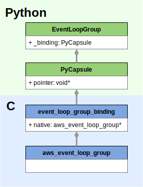
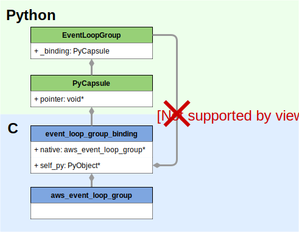
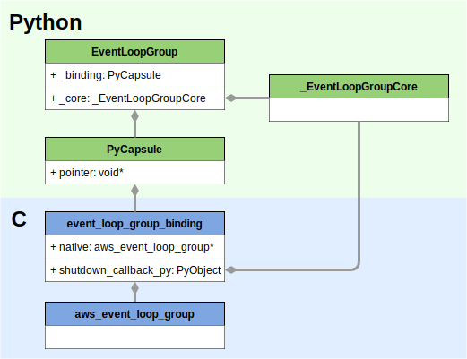

# Writing code in aws-crt-python

`aws-crt-python` provides "language bindings", allowing Python to use the
C libraries which make up the AWS SDK Common Runtime (CRT).

This is not easy code to write. You must know Python. You must know C.
You must learn how the aws-c libraries do error handling and memory management,
you must learn how the Python C API does error handling and memory management,
and you must mix the two styles together. This code is multithreaded and asynchronous.
Buckle up.

### Table of Contents

*   [Required Reading](#required-reading)
*   [Writing Python Code](#writing-python-code)
    *   [General](#general-python-rules)
        *   [Naming Conventions](#python-naming-conventions)
        *   [Use Type Hints](#use-type-hints)
    *   [Forward and Backward Compatibility](#forward-and-backward-compatibility)
        *   [Functions with Lots of Arguments](#functions-with-lots-of-arguments)
        *   [Use `None` for Optional Arguments](#use-none-as-the-default-value-for-optional-arguments)
        *   [Callback Signatures](#callback-signatures)
        *   [Be Careful When Adding](#be-careful-when)
    *   [Asynchronous APIs](#asynchronous-apis)
*   [Lifetime Management](#lifetime-management)
    *   [Terminology](#terminology)
        *   [Strong References / Reference Counting](#strong-references--reference-counting)
        *   [Reference Cycle](#reference-cycle)
        *   [Capsule](#capsule)
    *   [Bindings Design](#bindings-design)
    *   [A More Complex Example](#a-more-complex-example)
        *   [The Wrong Way to Build it](#the-wrong-way-to-build-it)
        *   [Option 1 - Pass Callbacks to C](#option-1---pass-callbacks-to-c)
        *   [Option 2 - Private Core Class](#option-2---private-core-class)
*   [Writing C Code](#writing-c-code)

## Required Reading

*   [Coding Guidelines for the aws-c Libraries](https://github.com/awslabs/aws-c-common#coding-guidelines) - Read this in full.
*   [Extending Python with C](https://docs.python.org/3/extending/extending.html) -
    Tutorial from python.org. Read this in full.
*   [Python C API Reference Manual](https://docs.python.org/3/c-api/index.html) -
    Don't need to read in full, but choice links provided:
    *   [Exception Handling](https://docs.python.org/3/c-api/exceptions.html)
    *   [Reference Counting](https://docs.python.org/3/c-api/refcounting.html)
    *   [Format strings: Python -> C](https://docs.python.org/3/c-api/arg.html) -
        Used by [PyArg_ParseTuple()](https://docs.python.org/3/c-api/arg.html#c.PyArg_ParseTuple)
    *   [Format strings: C -> Python](https://docs.python.org/3/c-api/arg.html#c.Py_BuildValue) -
        Used by [Py_BuildValue()](https://docs.python.org/3/c-api/arg.html#c.Py_BuildValue),
        [PyObject_CallMethod()](https://docs.python.org/3/c-api/call.html#c.PyObject_CallMethod),
        [PyObject_CallFunction()](https://docs.python.org/3/c-api/call.html#c.PyObject_CallFunction)
    *   [The Global Interpreter Lock (GIL)](https://docs.python.org/3/c-api/init.html#thread-state-and-the-global-interpreter-lock)


# Writing Python Code

Follow these conventions unless you have a very convincing reason not to.
We acknowledge that our existing code isn't 100% consistent at following them.
Some features we recommend now weren't available in older versions of
Python that we used to support. Some conventions are due to lessons learned
when we had a hard time making changes to something without breaking its API.
And sometimes naming is inconsistent because the code had different authors
and our conventions weren't written down yet. But going forward
let's do it right.

## General Python Rules

### Python Naming Conventions

*   Modules (files and folders) - `lowercase`
    *   Smoosh words together, if it's not too confusing.
    *   Example - `awscrt.eventstream` (NOT `aws_crt.event_stream`)
*   Classes - `UpperCamelCase`
    *   For acronyms three letters or longer, only capitalize the first letter
        *   Example: `TlsContext` (NOT `TLSContext`)
    *   Don't repeat words in the full path.
        *   Example: `awscrt.mqtt.Client` (NOT `awscrt.mqtt.MqttClient`)
*   Member variables - `snake_case`
*   Functions - `snake_case()`
*   Anything private - prefix with underscore
*   Constants and Enum values - `ALL_CAPS`
    *   Example: `MessageType.PING`
*   Time values - suffix with `_ms`, `_sec`, etc

### Use Type Hints

Use [type hints](https://docs.python.org/3/library/typing.html) in your APIs.
They help users and make it easier to write documentation.
Sadly, most of our existing code isn't using type hints because it was written
back when we supported older versions of Python
(TODO: add type hints to all our APIs).
Because type hints are newer, pay close attention in the docs before you use a feature,
to ensure it's available in our minimum supported Python version.
(TODO: add CI tests that would catch such errors)

## Forward and Backward compatibility

We need to design our APIs so that they don't break when we inevitably
add a few more configuration options to a class.
Follow these rules so we can gracefully alter the API without breaking it.

### Functions with Lots of Arguments

For functions with a lot of configuration options,
such as class `__init__()` functions, use one of the techniques below.
Complex functions inevitably get more optional arguments added over time.
Sometimes an argument even changes from required to optional.

TECHNIQUE 1 - Use [keyword-only](https://docs.python.org/3/tutorial/controlflow.html#keyword-only-arguments) arguments.
These let you introduce more arguments over time,
and they let you change an argument from required to optional.
They can also make user code more clear (i.e. `do_a_thing(ignore_errors=True)` vs `do_a_thing(True)`).
Example:
```py
class Client:
    def __init__(self, *,
                 hostname: str,  # this is required, but must be passed by keyword
                 port: int,  # again, required
                 bootstrap: ClientBootstrap = None,  # optional
                 connect_timeout_ms: int = None):  # optional
```

TECHNIQUE 2 - Use an "options class", and pass that as the only argument.
It's easy to build these as a [dataclass](https://docs.python.org/3/library/dataclasses.html).
Example:
```py
@dataclass
class ClientOptions:
    hostname: str
    port: int
    bootstrap: ClientBootstrap = None
    connect_timeout_ms: int = None

class Client:
    def __init__(self, options: ClientOptions):
```

The jury's currently out on which technique is better. Keyword arguments are graceful,
but "options classes" let us easily nest one set of options inside another set of options.

### Use `None` as the Default Value for Optional Arguments

Note in the examples above that `connect_timeout_ms` had a default value of `=None`,
instead of something concrete like `=5000`. This is a common in Python,
and a good practice besides. Default values sometimes change.
There are many aws-crt language bindings, and the fewer places something is hardcoded,
the easier it is to change. Ideally, all language bindings use `None` or similar
to represent "defaults please", which results in passing `0` or `NULL` down to C to
represent "defaults please", and then in a single location in C we set the actual default.

In documentation, just say "a default value is used" instead of writing in the actual value,
because the odds are good that the documentation will get out of sync with reality.

### Callback Signatures

Similar to how we build `__init__()` functions so that more options can be added over time,
we need to build callbacks so that more info can be passed to them in the future.

Public callbacks should take a single argument, which is built as a `dataclass`.
This gives us freedom to add members to the class in the future.

Example:
```py
@dataclass
class Message:
    topic: str
    payload: bytes

class Client:
    def __init__(self, *,
                 ...,
                 on_message_received: Callable[[Message], None] = None,
                 ...)

# and then user code looks like:
def my_on_message_received_callback(msg):
    print(f'Yay I got a Message: {msg}')
```

NOTE: Most of our existing code uses a different pattern for callbacks.
Instead of a single `dataclass` argument, multiple arguments are passed by keyword.
In documentation, we instruct the user to add `**kwargs` as the last argument in their function,
so that we are free to add more arguments over time without breaking user code.
This is weirder and more fragile than passing a single object.
Don't use this pattern unless you're adding to a class where it's already in use.

### Be careful when adding

1)  When adding arguments to a function that is NOT using keyword-only arguments,
    you MUST add new arguments to the end of the argument list.
    Otherwise you may break user code that passes arguments by position.

2)  When adding new members to a `dataclass`, you MUST add new members at the end.
    Otherwise you may break user code that initializes the class using positional arguments.
    (in Python 3.10+ there's a `kw_only` feature for `dataclass`,
    but we can't use it since we support older Python versions)

## Asynchronous APIs

TODO: document when to use future vs callback

# Lifetime Management

## Terminology

### Strong References / Reference Counting

A "strong reference" is one that keeps an object alive by incrementing its reference count.
When all references to an object are released (reference count goes to zero), it gets cleaned up.

In Python code, every variable is a strong reference to an object.
When the variable goes away, the reference is released.
C code can create a strong reference to a Python object by calling `Py_INCREF(x)`,
and release the reference by calling `Py_DECREF(x)`.
Note that EVERYTHING in Python is an object: even functions, even numbers, even `None`.

In the aws-c libraries, you create a strong reference to a struct by calling
its `_acquire(x)` function, and release by calling its `_release(x)` function.
Within the aws-c libraries, structs keep each other alive as long as necessary using these functions.
Not every struct in the aws-c libraries has `_acquire(x)` and `_release(x)` functions,
only heap-allocated structs with complex or unpredictable lifetimes.
Every struct bound to a Python class is considered to have an unpredictable lifetime.

### Reference Cycle

A "reference cycle" is when a circle of strong references is created.
Reference cycles cause memory to leak because the reference counts never get to zero.

Python has a [garbage collector](https://devguide.python.org/internals/garbage-collector)
that can detect and clean up reference cycles among normal Python objects.
HOWEVER, any cycle involving a `Py_INCREF(x)` from C creates an undetectable cycle.
You MUST NOT create reference cycles when designing bindings.

### Capsule

[PyCapsule](https://docs.python.org/3/extending/extending.html#using-capsules)
lets us bind the lifetime of a C struct to the lifetime of a Python object.
The `PyCapsule` is a Python object holds a C pointer and a "destructor" function pointer.
When Python cleans up the `PyCapsule`, the destructor function will be called.

## Bindings Design

Let's look at the bindings for `aws_event_loop_group` (our I/O thread pool).
This diagram shows the strong references between objects in Python and C:



Description of parts:
*   `aws_event_loop_group` - The underlying native implementation struct,
    which knows nothing about Python.
    *   Lives in C library: `aws-c-io`
    *   Header file: `crt/aws-c-io/include/aws/io/event_loop.h`
*   `event_loop_group_binding` - The "bindings" struct.
    Holds a strong reference to the underlying native implementation (usually in a member variable named "native")
    *   Lives in Python/C extension module: `_awscrt`
    *   Source file: `source/io.c`
*   `PyCapsule` - The Python object which "owns" the pointer to `event_loop_group_binding`.
*   `EventLoopGroup` - The Python class that users create and interact with.
    Holds a reference to the `PyCapsule` in a member variable named "_binding".
    *   Lives in Python module: `awscrt.io`
    *   Source File: `awscrt/io.py`

Creation goes like this:
*   User's Python code creates an `EventLoopGroup`:
    ```py
    elg = EventLoopGroup()
    ```
*   `EventLoopGroup` initializer looks something like:
    ```py
    class EventLoopGroup:
        def __init__(self, ...):
            self._binding = _awscrt.event_loop_group_new(...)
    ```
*   `_awscrt.event_loop_group_new(...)` is Python calling down into C.
    The C function looks something like:
    ```C
    PyObject *aws_py_event_loop_group_new(PyObject *self, PyObject *args) {
        // ...parse arguments...

        // allocate memory for binding struct
        struct event_loop_group_binding *binding = aws_mem_calloc(...);

        // create underlying implementation
        binding->native = aws_event_loop_group_new(...);

        // create PyCapsule which owns the binding struct.
        // pass in "destructor" function that runs when
        // PyCapsule is cleaned up by the garbage collector.
        PyObject *capsule = PyCapsule_New(binding, on_capsule_destroyed_fn);
        return capsule;
    }
    ```
*   Things stay alive because:
    *   The user's `elg` variable keeps the `EventLoopGroup` object alive.
    *   Member variable `EventLoopGroup._binding` keeps the `PyCapsule` alive.
    *   The `PyCapsule` keeps the `struct event_loop_group_binding` alive.
    *   The `event_loop_group_binding.native` pointer is a "strong reference" that keeps
        `struct aws_event_loop_group` alive.


Destruction goes like this (it's actually more complex, we'll cover that later):
*   When the user's Python code has no references to `elg`, the `EventLoopGroup` instance...
*   The garbage collector cleans up the `EventLoopGroup`,
    and the `PyCapsule` referenced by `EventLoopGroup._binding`.
*   The `PyCapsule`'s destructor function runs, which looks something like:
    ```C
    static on_capsule_destroyed_fn(PyObject *capsule) {
        struct event_loop_group_binding *binding = PyCapsule_GetPointer(capsule);

        // release reference to underlying implementation
        aws_event_loop_group_release(binding->native)

        // free binding struct's memory
        aws_mem_release(binding);
    }
    ```
*   IF nothing else has a strong reference to `struct aws_event_loop_group`:
    *   then it begins its shutdown process, and its memory is cleaned up when shutdown completes.
*   ELSE something else has a strong reference to `struct aws_event_loop_group`:
    *   so it won't begin its shutdown until the last reference is released.

Note: In the past, the aws-c libs didn't have any reference counting for its C structs.
You will still find older code in our Python bindings that tries to keep the entire dependency trees
of Python objects alive via `Py_INCREF(x)` (TODO: remove needless complexity).
You can't always look at existing code to see "the right way" of doing things.

## A More Complex Example

The sample above is simplified. It shows Python calling into C,
but never shows C calling back into Python.

But when a C callbacks happens, C needs to call into Python.
C can't call into Python without a reference to a Python object
(in Python, even a function is an object).
Therefore, the binding must store a strong reference to a Python object
keeping it alive until the callback is done firing.

### The Wrong Way to Build it

You MUST NOT create a reference cycle!

You might be tempted to give `event_loop_group_binding` a strong reference to the `EventLoopGroup` instance.
Then C could simply call a private member function like `EventLoopGroup._on_shutdown_complete()`.
But this design creates a reference cycle (see image below):



### Option 1 - Pass Callbacks to C

Most of our bindings work like this:


Within `EventLoopGroup.__init__()` a "callable" is defined and passed down to C.
`event_loop_group_binding` keeps a strong reference to this Python object.

When the final shutdown callback happens in C, the Python callable
is invoked, and then the reference is released via `Py_DECREF(x)`.

Destruction goes like this:
*   When the Python code has no references to `elg`, the `EventLoopGroup` instance...
*   The garbage collector cleans up the `EventLoopGroup`,
    and the `PyCapsule` referenced by `EventLoopGroup._binding`.
*   The `PyCapsule` runs its destructor function.
    *   The destructor function calls `aws_event_loop_group_release(binding->native)`,
        but doesn't delete the `event_loop_group_binding` struct yet.
*   The `aws_event_loop_group` won't shutdown until nothing else is referencing it.
    Even when the final reference is released, it still needs to wait for the threads
    in its thread-pool to finish their shutdown process.
*   Finally, shutdown completes and the C callback is invoked.
    *   The C callback invokes the Python `callable`, then releases it via `Py_DECREF(x)`.
        *   Now the garbage collector can clean up the `callable` object.
    *   The C callback finally deletes the `event_loop_group_binding`.
        This struct only existed to keep two strong references,
        but now they've both been released.

### Option 2 - Private Core Class

Another option is to build a private `_Core` class that contains anything
that may need to outlive the main Python object.
This technique hasn't actually been used, but the author of this doc
thinks it might be a graceful way to build in the future:



# Writing C Code

TODO:
Talk about how our tests can and cannot check for leaks.
Talk about which classes require a `close()` function, and which don't.
Suggest writing as little C code as possible.
Recommend error-handling strategies.
Talk about the allocators (tracked vs untracked)
Talk about logging. Consider making it easier to turn on logging.
Talk about sloppy shutdown.

